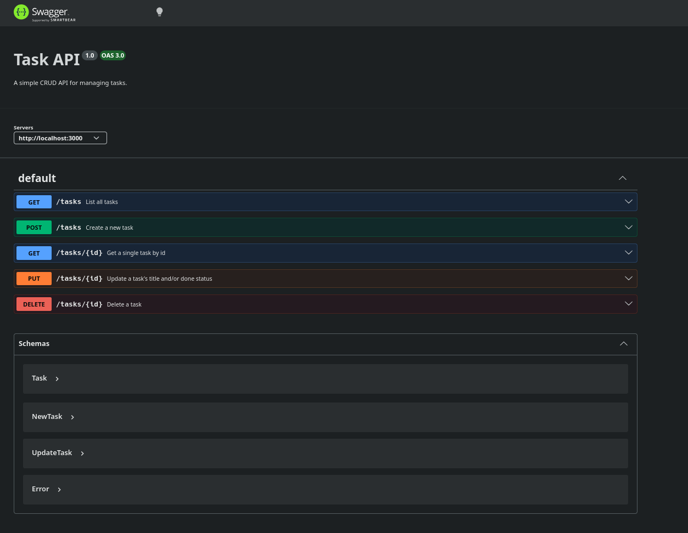

# Task API

A small CRUD API for managing tasks — built with Express and TypeScript as part of a backend learning project.

## What this is

Basically a to-do list, but as an API instead of an app. You can create tasks, look them up, mark them done, update them, or delete them. Nothing fancy — just a clean example of how a real backend handles requests, validates input, and responds with the right status codes.

It also comes with interactive docs (Swagger UI), so you don't even need curl to try it out — you can just click buttons in the browser.

Tasks are stored in a real SQLite database now, so your data survives a server restart — no more losing everything every time you `Ctrl+C`.

## Getting it running

You'll need Node.js (v18 or newer) installed.

```bash
git clone https://github.com/ask-elad/backend-ai.git
cd backend-ai
npm install
npm run dev
```

That's it — the server comes up at `http://localhost:3000`.

## Database

Tasks are stored in **SQLite**, via `better-sqlite3`. It was the natural choice here — it's a single-file database with no separate server process to install or run, which fits a small project like this perfectly.

- **File:** `tasks.db`, created automatically in the project root the first time you run the server. It's git-ignored, so every clone generates its own fresh copy.
- **Table:** `tasks (id INTEGER PRIMARY KEY, title TEXT, done INTEGER)`, also created automatically if it doesn't exist.
- Three example tasks are seeded only if the table is empty — restart the server as many times as you want, they won't duplicate.

### Example SQL query

```sql
SELECT * FROM tasks WHERE done = 1;
```

Run manually against `tasks.db` (e.g. via `sqlite3 tasks.db` or DB Browser for SQLite), this returns only the completed tasks — and the API's `GET /tasks` response reflects any change made this way immediately, since the database is the single source of truth.

## Endpoints

| Method | Endpoint      | What it does                          | Success | Errors       |
|--------|---------------|-----------------------------------------|---------|--------------|
| GET    | `/`           | Basic info about the API                | 200     | —            |
| GET    | `/health`     | "Am I alive?" check                     | 200     | —            |
| GET    | `/tasks`      | Get all tasks                           | 200     | —            |
| GET    | `/tasks/:id`  | Get one task                            | 200     | 404          |
| POST   | `/tasks`      | Create a task                           | 201     | 400          |
| PUT    | `/tasks/:id`  | Update a task's title and/or done       | 200     | 400, 404     |
| DELETE | `/tasks/:id`  | Delete a task                           | 204     | 404          |
| GET    | `/docs`       | Interactive API docs (Swagger UI)       | 200     | —            |

## A quick example

Here's what creating a task actually looks like:

```
$ curl -i -X POST http://localhost:3000/tasks -H "Content-Type: application/json" -d '{"title":"Buy milk"}'

HTTP/1.1 201 Created
X-Powered-By: Express
Content-Type: application/json; charset=utf-8
Content-Length: 40

{"id":4,"title":"Buy milk","done":false}
```

## Try it in the browser

If curl isn't your thing, head to `http://localhost:3000/docs` once the server's running. It's Swagger UI — every endpoint is listed with a "Try it out" button that sends real requests, no terminal required.



## Built with

- Node.js + Express
- TypeScript
- swagger-ui-express
